# DuoTrace Fabric architecture

This architecture keeps the live DuoTrace experience separate from the scheduled analytics platform while connecting both to the same application data.

```mermaid
flowchart LR
  user[User enters any two Riot IDs]
  app[DuoTrace web app]
  worker[Cloudflare Worker\nLive Riot API lookup]
  riot[Riot Games API\nMatch history]
  d1[Cloudflare D1\nCompleted search events]
  export[Protected Worker endpoint\nIncremental analytics export]
  pipeline[Fabric Data Pipeline\nScheduled notebook run]
  bronze[OneLake Lakehouse — Bronze\nRaw application export]
  silver[OneLake Lakehouse — Silver\nClean searches, players, and matches]
  gold[OneLake Lakehouse — Gold\nDuo metrics and quality results]
  warehouse[Fabric Warehouse\nStar schema]
  report[Power BI\nDuo Insights and Pipeline Health]
  monitor[Run log and data-quality checks]

  user --> app
  app --> worker
  worker --> riot
  worker --> d1
  d1 --> export
  export --> pipeline
  pipeline --> bronze
  bronze --> silver
  silver --> gold
  gold --> warehouse
  warehouse --> report
  pipeline --> monitor
  gold --> monitor
```

## Data layers

| Layer | Purpose | Example contents |
| --- | --- | --- |
| Bronze | Preserve the source response for traceability and reprocessing. | Raw Riot account, match-list, and match-detail JSON. |
| Silver | Create clean, typed tables with consistent identifiers. | `players`, `matches`, and `player_matches`. |
| Gold | Produce tables used by reporting and operations. | Duo win rates, shared-match counts, and quality-check outcomes. |

## Application data contract

Fabric does not call Riot directly and does not limit who can use DuoTrace. It ingests completed lookups recorded by the real application. The Worker export endpoint is protected with a token that Fabric retrieves from Azure Key Vault at runtime.

## Warehouse model

The Warehouse will contain a small star schema for reporting:

- `fact_player_match` records one player's participation in one match.
- `fact_duo_match` records the relationship between the two selected players in a shared match.
- `dim_player`, `dim_champion`, `dim_queue`, and `dim_date` provide reporting dimensions.

## Operational checks

Each pipeline run will record its start and finish time, processed-row counts, API failures, retries, and duplicate-match checks. The Power BI Pipeline Health page will read those run records rather than relying on manually entered status values.
